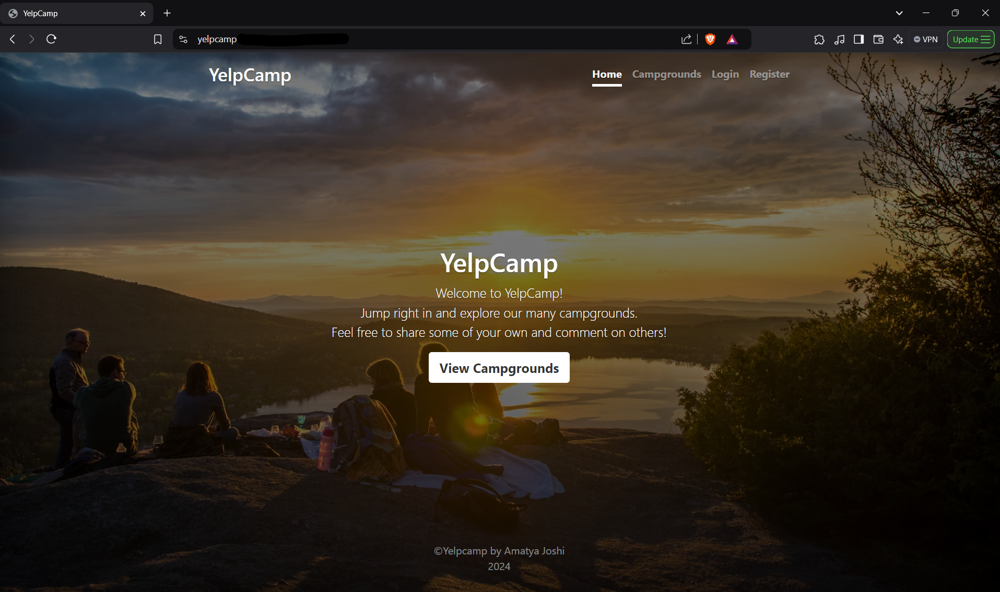
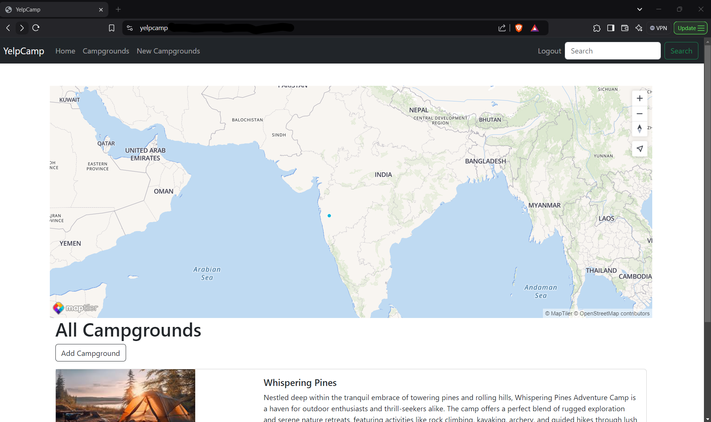

# YelpCamp - Campground Review Web Application

## Project Overview
YelpCamp is a full-stack web application that allows users to create, review, and browse campgrounds. Inspired by Yelp, this project is part of Colt Steele's Web Developer Bootcamp. Users can add campgrounds with descriptions, upload images, and leave reviews. The platform focuses on CRUD functionality, user authentication, and responsive design.

---

## Key Features
- **User Authentication**  
  - Secure login and registration using Passport.js.
  - Authorization for editing/deleting user-created campgrounds.

- **Campground Management**  
  - Create, read, update, and delete (CRUD) campgrounds.  
  - Upload and manage images through Cloudinary.  
  - Location-based services using Mapbox for campground geolocation.

- **Review System**  
  - Users can leave reviews and ratings for campgrounds.  
  - Review moderation and spam prevention.

- **Responsive Design**  
  - Fully responsive interface using Bootstrap.  
  - Mobile-first approach.

---

## Tech Stack
- **Frontend:** EJS (Embedded JavaScript), HTML5, CSS3, Bootstrap  
- **Backend:** Node.js, Express.js  
- **Database:** MongoDB (Mongoose for ODM)  
- **Authentication:** Passport.js (Local, Google OAuth)  
- **Image Upload:** Cloudinary  
- **Geocoding:** MapTiler API  
- **Deployment:** Render  

---

## Project Structure
```
YELPCAMP/
│
├── public/
│   ├── css/
│   ├── js/
│   └── images/
│
├── routes/
│   ├── campgrounds.js
│   ├── reviews.js
│   └── users.js
│
├── views/
│   ├── campgrounds/
│   ├── partials/
│   ├── reviews/
│   └── home.ejs
│
├── models/
│   ├── campground.js
│   ├── review.js
│   └── user.js
│
├── app.js
└── README.md
```

---

## How to Run the Project
### Prerequisites
Ensure you have the following installed:
- Node.js (v18+)
- MongoDB
- npm or yarn

### Setup and Installation
1. Clone the repository:  
   ```bash
   git clone https://github.com/your-username/yelpcamp.git
   ```
2. Navigate to the project directory:  
   ```bash
   cd yelpcamp
   ```
3. Install dependencies:  
   ```bash
   npm install
   ```
4. Configure environment variables (in `.env` file):  
   ```
   DATABASE_URL=<your-mongo-db-uri>
   CLOUDINARY_CLOUD_NAME=<your-cloudinary-name>
   CLOUDINARY_KEY=<your-cloudinary-key>
   CLOUDINARY_SECRET=<your-cloudinary-secret>
   MAPTILER_TOKEN=<your-maptiler-token>
   ```
5. Seed the database (optional):  
   ```bash
   node seeds/index.js
   ```
6. Run the application:  
   ```bash
   node app.js
   ```

---

## API Endpoints
### Campground Management
- **GET** `/campgrounds` - View all campgrounds
- **POST** `/campgrounds` - Create a new campground
- **GET** `/campgrounds/:id` - View a single campground
- **PUT** `/campgrounds/:id` - Edit campground details
- **DELETE** `/campgrounds/:id` - Delete a campground

### Reviews
- **POST** `/campgrounds/:id/reviews` - Add a review
- **DELETE** `/campgrounds/:id/reviews/:reviewId` - Delete a review

---

## Screenshots
### Home Page


### Campground Details


---

## Future Enhancements
- Integration of payment systems for campground bookings.  
- Real-time chat for campground visitors.  
- Social sharing and community features.

---

## Contributing
We welcome contributions to YelpCamp! If you'd like to contribute:
1. Fork the repository.
2. Create a feature branch:  
   ```bash
   git checkout -b feature/new-feature
   ```
3. Commit your changes:  
   ```bash
   git commit -m "Add new feature"
   ```
4. Push to the branch:  
   ```bash
   git push origin feature/new-feature
   ```
5. Create a pull request.

---

## License
This project is licensed under the MIT License.

---

## Acknowledgments
- **Colt Steele** - For creating the Web Developer Bootcamp and inspiring this project.

